# Basic Infomation

This guide is made to be a central location for all information related to running Voices of The Void on a linux system, including the methods to install it, the ways to run it properly, and how to fix some of the well known issues.

Please note that Voices of The Void isn't made with Linux in mind, so while it's possible to run VotV on Linux and even do so well, there may always be issues that will crop up that's out of your control. Additionally, make sure to avoid reporting bugs to the Votv devs without assuring the issue is not a linux exclusive bug.

## Overview

This guide is split into acouple main sections, Basic Infomation, Installation, Launching, Configuring, and Issues.

Each section should cover everything you'd need to know about Voices of The Void on Linux, feel free to skim through all the options to find what seems to be the best for you.

Incase you're unsure or overwhelmed, you can simply follow the methods tagged with *(Recommended) in Installation and Launching without too much hassle.

# Installation

There's two main methods to install Voices of The Void on your system, you can use the official YeetPatch script to download it, or you can manually download it from the itch.io and extract it using 7zip.

There's also a third secondary method by using Lutris, a dedicated game and program installer and launcher. However, by using Lutris to install it you will also need to launch it with Lutris, so for that reason using Lutris is located in the 'Running Voices of The Void’ section of this guide.

## Yeetpatch *(Recommended)

Yeetpatch is an offical launcher for updating and installing VotV, including an option for linux using a shell (.sh) script. You can download it here:
https://votv.dev/patcher#
Make sure to get the linux option from the "Get it here" button on the site.

Download the file to a location you'll remember, such as your desktop or a folder in your Home directory. Once downloaded you can open a terminal in the same location (or ``cd`` there) and run the script like so:

```
./YeetPatch.sh
```

This should open a basic help screen in your terminal to help guide you on using the script, and importantly to tell you to configure the script itself for usage.

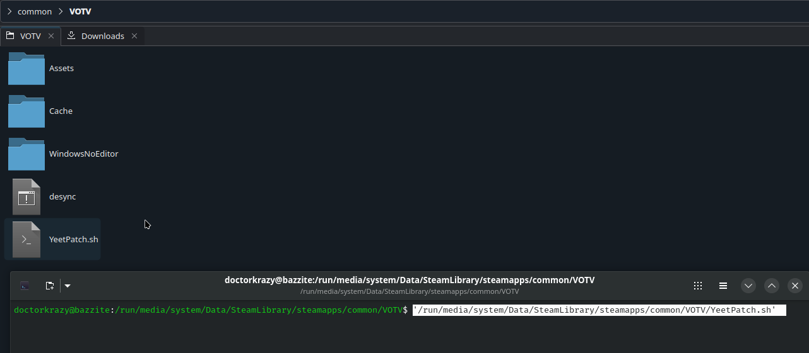

To configure the script itself open the ``YeetPatch.sh`` file in a text editor like it was any other text file, and scroll down to the area marked ``- config -`` and find the ``- INSTALL`` section below that. It should look something like:

```
# --- INSTALL
INSTALL_DIR=""                                                              # game install path (folder)
CACHE_DIR=""                                                                # optional: data cache folder
STORE_URL="https://votv.dev/patcher_assets/256-1024-4096-store"             # datastore url
SAVEGAME_DIR=""                                                             # optional: path to saves to back up; leave empty to skip
INSTALL_CATALOG_URL="https://votv.dev/patcher_assets/index_manifest.json"   # optional: override via --catalog; expects array of {name,hash,link}
BACKUPS_DIR="$SCRIPT_DIR/backups"                                           # optional: save backups directory (if SAVEGAME_DIR is set)
```

The only required path you need to add is the INSTALL_DIR, as that's where the script will install VotV to. Any location can work, you can make a dedicated folder for Votv in your Home Directory, such as Home/Programs/VoicesOfTheVoid, if you're aimming to play Votv through steam you can also install it with the rest of your steam games, it just has to point somewhere.

Here's an example of what it looks like setup:

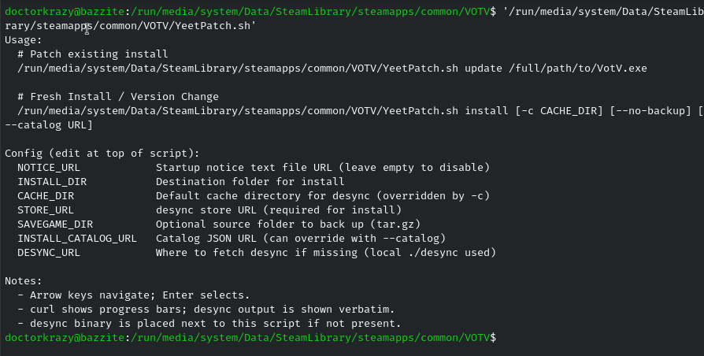

Save your changes and go back to the terminal you opened and run:
```
./YeetPatch.sh install
```

If configured correctly, this should bring up a list of VotV versions to install that you can move through using the up and down arrow keys, you can then use the Enter key to select the build you want. Keep in mind any builds labled [UNSTABLE] are shadow test versions, essentially WIP builds not quite stable yet but still public for testing purposes, if you're unsure select the newest option without the [UNSTABLE] label.

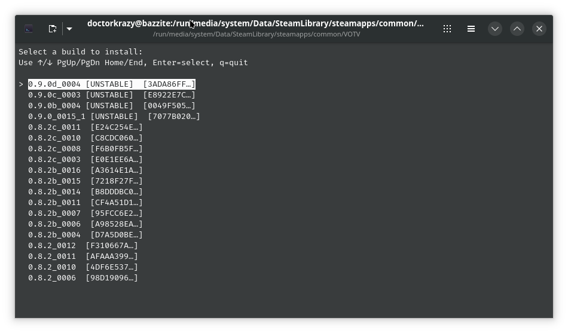

Now simply type in 'y' and hit enter again to proceed with the installation.

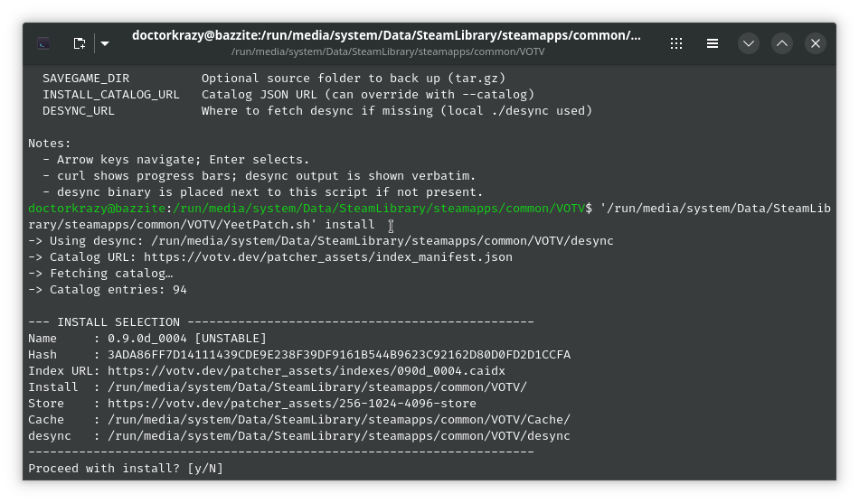

And after some waiting, VotV should be successfully installed to the location you chose!

## Manually

TODO: Write this bit, I'm too lazy rn.

# Launching

Now there's multiple ways to get VotV to run your system, all of them involve using what's known as a "Compatibility Layer" that translates the normal windows instructions to something linux can understand, allowing you to run it. There's two main Compatibility Layers: Wine, a generic Windows Program Layer which can launch Windows .exe files, or Proton, a modified version of Wine made by Valve for gaming that can be used on Steam.

To use a Compatibility Layer there's three main ways, you can add VotV to steam as a non-steam game to use Proton, you can use Lutris to install and download VotV and use Wine (or Proton), or directly launch VotV with wine from the command line.

Generally speaking you'll want to use the first method as Proton is generally considered superior over Wine in almost every way, as it has better support for DirectX11 and DirectX12 apis that VotV uses by default.

## Using Steam & Proton *(Recommended)

There's three guides on how add VotV as a non-steam game, to cover all the bases. The first method is a text guide on using an automated script to do most of the work for you, the second is a video guide on how to do it manually, and third is a step-by-step text guide.

Feel free to follow whichever feels easist for you.

### Automated Script *(Recommended)

TODO: Add this

### Video Guide

TODO: Need... video...

### Text Guide

Assuming you've already installed VotV as directed earlier in this tutorial, please open steam and click “Games” on the top left of the Steam Window and hit “Add a Non-Steam Game to My Library…”

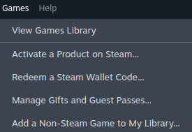

This will open up a separate window, you’ll need to hit “Browse…” in the bottom left.

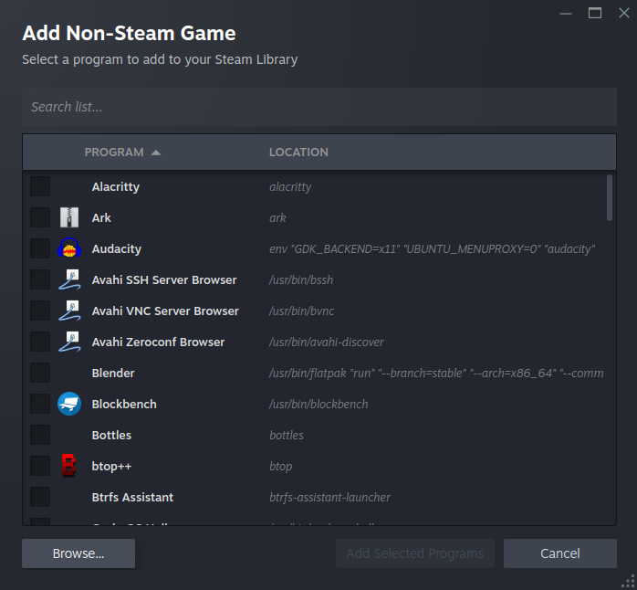

This will open a file browser, you’ll now need to navigate to “?/a09d_0004/WindowsNoEditor/VotV.exe” with ‘?’ being where you’ve installed it. For me that would be “/home/slepdepriv/Programs/a09d_0004/WindowsNoEditor/VotV.exe”

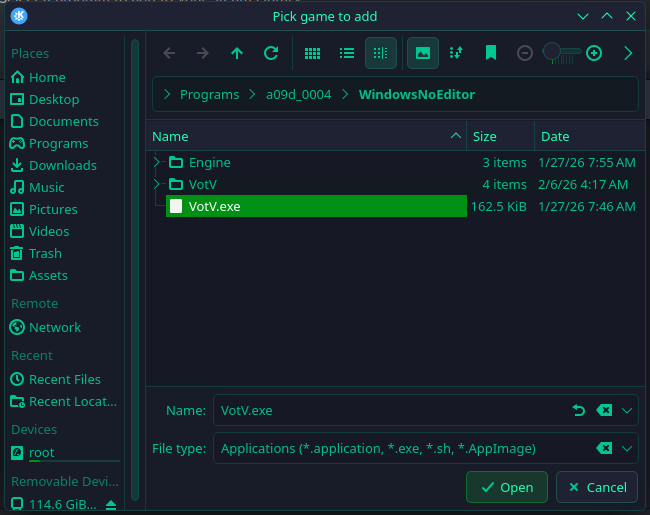

Once found click on it then hit “Open” (or “Select” or so forth, as it may differ based on the Distro you use). This will close the file browser and add “VotV.exe” to the bottom of the list shown in the “Add Non-Steam Game” window. Make sure it’s checkmarked shown in the image below, then hit “Add Selected Programs”

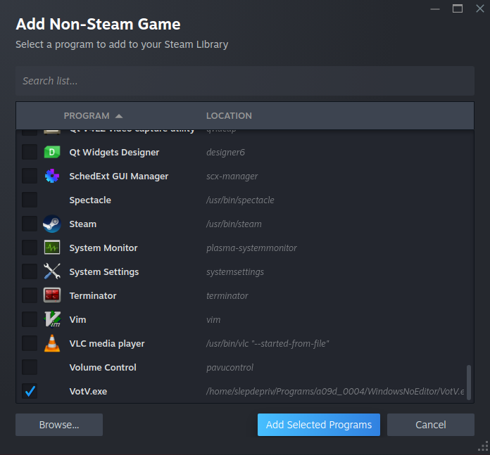

This will add “Votv.exe” to your Steam Library like it was any other game.

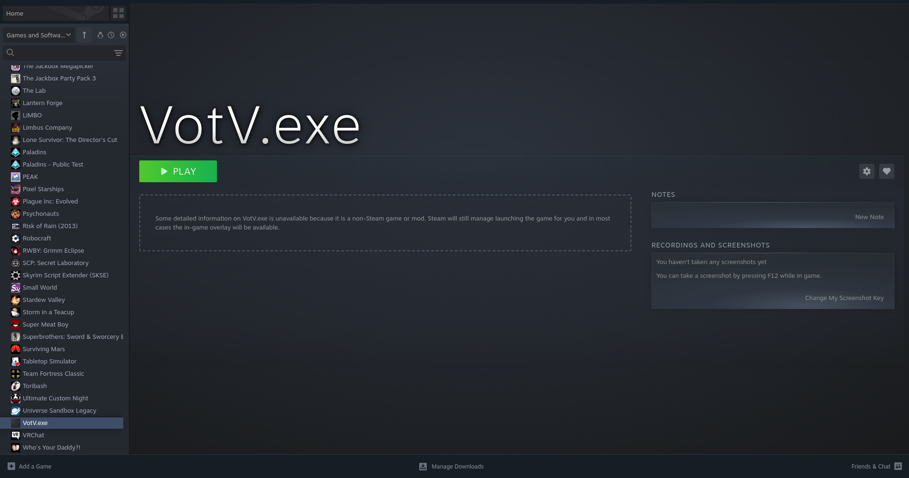

Now you’ll need to tell Steam to launch Votv.exe with Proton. Right click on Votv.exe in the list and go to “Properties…”

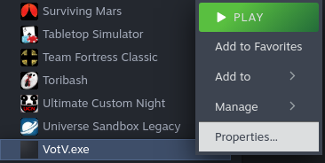

Then click "Compatibility" in the opened window.

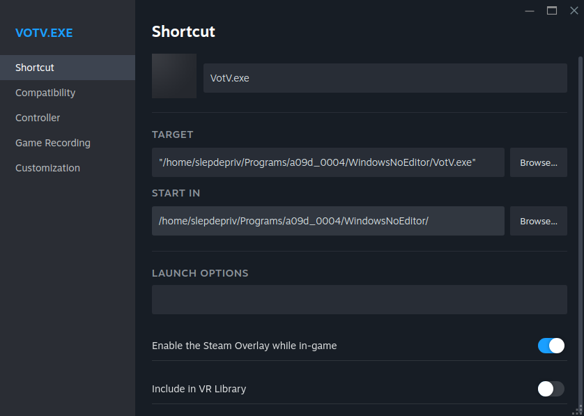

Then click “Force the use of the specific Steam Play compatibility tool” and select the newest Proton version from the dropdown list below, at the time of writing that would be “Proton 10.0-4”

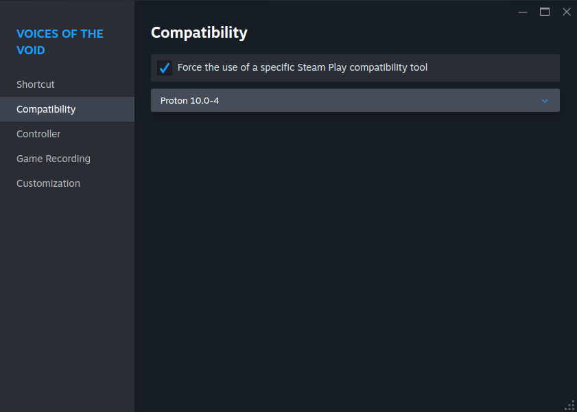

And that’s the bare minimum required, there’s more you can do to fix additional issues as documented in the Issues part of this guide along with some additional optimization, but this is enough to just make the game run.

And as a tip, you can rename “Votv.exe” in the “Shortcut” area of the properties menu, and add a custom icon from your computer by clicking the blank square next to the name, though you’ll need to restart steam for the icon to take effect. You can also add custom images in the “Customization” area to display in various places in steam when viewing the game.

## Using Lutris

For convenience there's both a Video and Text step-by-step guide on how to both Install and Run VotV using Lutris, follow whichever is more comfortable for you. 

### Video: 
- Watch video: [**Youtube**](https://youtu.be/2kMQBnCn6eQ)
- Download video: [**Google Drive**](https://drive.google.com/file/d/11npOZPIhTXN4jOrNDKQOC_vKgtWjIHuG/view?usp=sharing) 

### Step by step:
- Open Lutris and press on the + button on the top left

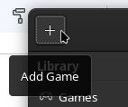

Click on “Search the Lutris website for installers”

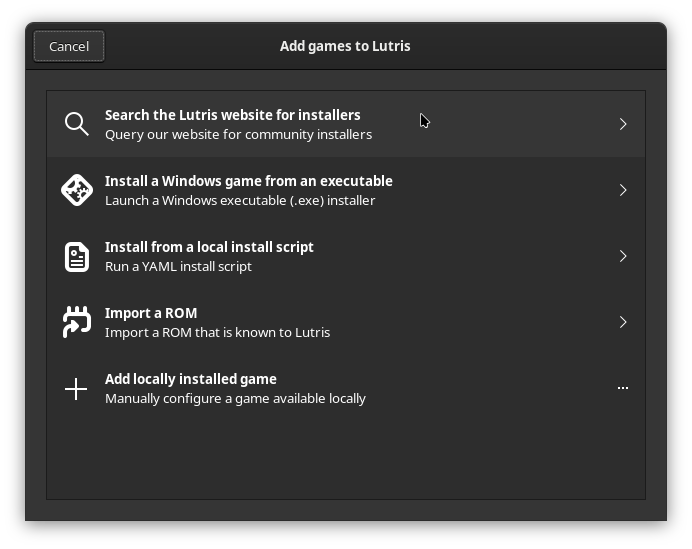

Search “Voices of the Void”

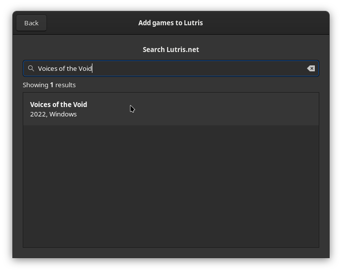

Select either “Stable” or “Test” (if available)
Latest Stable Build is, as the name suggests the latest stable version
Latest Test Build are public test build, they have the latest features but are to be used at your own discretion as bug or issues may occur

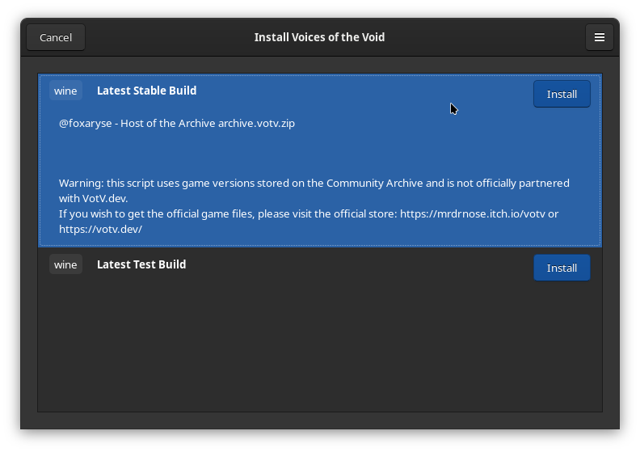

Choose where you want the game to be installed

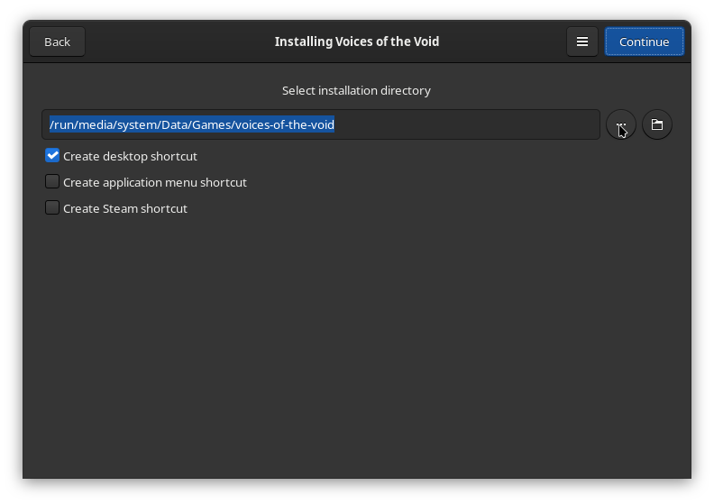

On this screen it is recommended to use the “Download” source, so you download the latest version

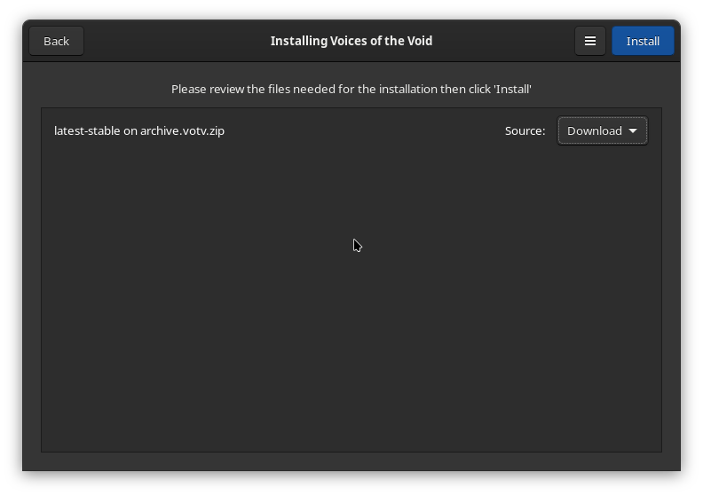

After that, just wait for the game to download, extract and install.

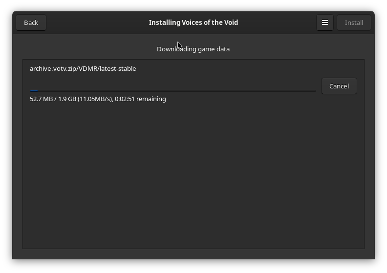

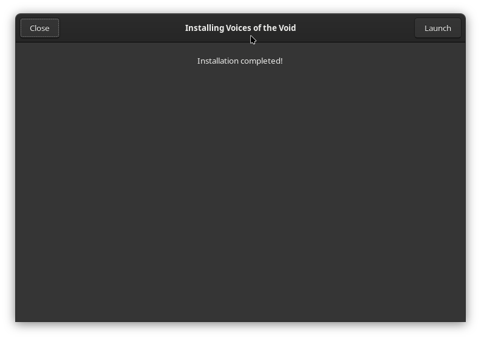

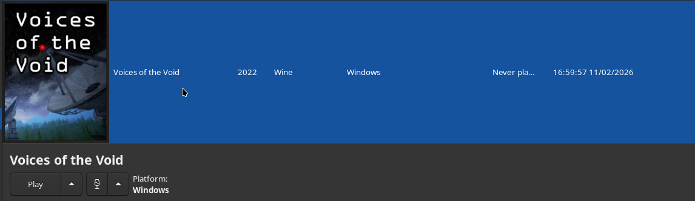

### Using Wine
Perhaps the most direct way of playing VotV on Linux but lacks the robustness something like Steam & Proton or even Lutris can provide, however it’s a completely viable option.

Assuming you already have wine installed on your device, if you don’t I’d recommend looking up specific instructions for your Distro. With wine installed, open your terminal and cd into the WindowsNoEditor folder in your votv’s install location, for me that would be “cd /home/slepdepriv/Programs/a09d_0004/WindowsNoEditor/”. Then simply run “wine Votv.exe -vulkan, Votv should shortly launch and you’ll be ready to play.”

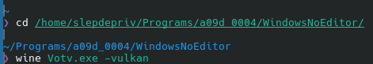

It’s worth noting that you can run Votv without the -vulkan option, at the cost of reduced performance.

# Configuration


## Using Custom Assets
Voices of The Void features the ability to add custom assets (Custom Paintings, Posters, Radio Songs, TV Videos, etc) to be used in-game by placing them in a dedicated “Assets” folder. By default Votv expects this folder to be in a windows installation’s appdata/local/votv location, which Linux doesn’t have.

There’s a couple solutions to this: The compatibility layer used to launch Votv (either Wine or Proton) will actually make a fake windows file system including a appdata/local/votv location that the Assets folder will be made in, though finding it can be tricky. You can also tell Votv to use an alternative location on your file system for Assets, however this can cause some issues.

### Method 1: Finding the Assets folder
Using wine it’s by far the easiest find as it’s simply located at: “/home/<YOURNAME>/.wine/drive_c/users/<YOURNAME>/AppData/Local/VotV/Assets”

However using Proton it’s a tad more complicated, first make sure you’ve launched Votv at least once from steam, then you’ll need to find your Steam folder location. For most it should be at: “/home/<YOURNAME>/.steam/steam/” though if you can’t find it there also look for “/home/.local/share/steam”

Then from steam you’ll need to navigate to “/Steam/steamapps/compatdata/” which should be filled with folders with seemingly random numbers for names, now comes the annoying part, you’ll need to figure out which of these numbered folders steam assigned to Votv by mostly guess work. I’d recommend setting your file explorer to sort by last modified or last created, then assuming you’ve added Votv recently it should appear as the first folder in the list.

Assuming you’ve gotten the right one, you’ll find the asset folder at “Steam/steamapps/compatdata/<SOME NUMBERS>/pfx/drive_c/users/steamuser/AppData/Local/VotV/Assets” if you can’t find it there, then you’ve picked the number folder and need to try again.

I’d recommend adding the asset folder to your file browser’s places/bookmarks/favorites/etc to avoid having to hunt it down again.

### Method 2: Setting a custom Assets folder location
First you’ll need to make a folder somewhere on your computer to act as the Assets folder, for me I’ll use “/home/slepdepriv/VotvAssets” though it can be put anywhere and named anything you want.

Then you’ll need to open Voices of The Void and go to Settings then Extras, there you’ll find this batch of options shown below.

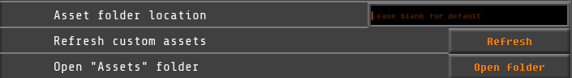

Unfortunately you can’t just paste the folder location into the bar without some issues due to how Unreal and Wine/Proton handle the file system, instead you need to find the “window-ized” version of the folder path that Wine/Proton tricks Votv into believing exists.

Luckily this is fairly easy, first click the “Open “Assets” folder” button which should open up a fairly dated looking file browser with the default assets folder open.

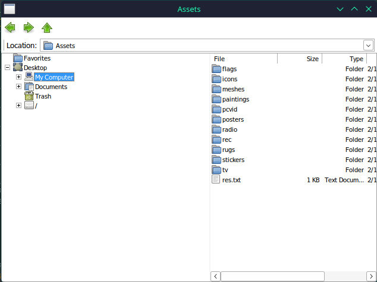

This however isn’t a normal file browser but instead a Wine/Proton specific browser that displays what Votv thinks the file system looks like, which is exactly what we need. Click on “My Computer” and search through the single letter folders until you find the linux file system, for me it’s Z.

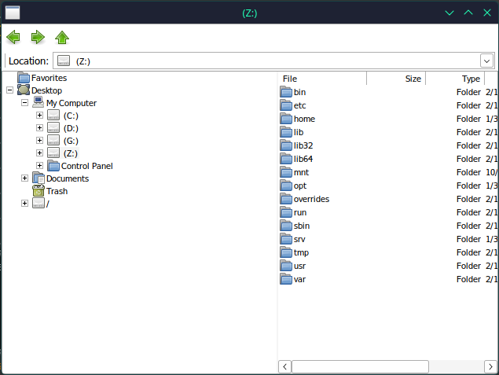

From there find the folder you created earlier to be the Assets Folder, for me that’s “/home/slepdepriv/VotvAssets” then in the location bar the top click in the empty space and copy the path.


With it copied you can close the file browser and then paste the path into the “Asset folder location” text box

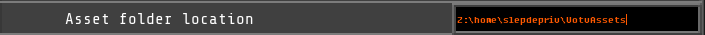

Then just click “Apply” in the bottom right of settings, if it works you should see Votv generate a bunch of folders in your designated Asset folder.

For more information on how to use the custom asset folder please see the Hints and tips menu in-game and search for “custom” or the community wiki guide on the subject https://voicesofthevoid.wiki.gg/wiki/Guides/Custom_Content

## Custom Resolutions
Using Gamescope you can make Voices of The Void use any custom resolution you desire, this is required if you’re playing on a Steam Deck since it requires a resolution of 1280x800 which Votv doesn’t support by default. You can install Gamescope from these repos https://repology.org/project/gamescope/versions or if you’re on Steam Deck it’s pre-installed.

Gamescope can also be used for more things like additional setting for running Voices of the Void in a window or as a boardless window, visit https://github.com/ValveSoftware/gamescope for more info.

### Using Gamescope with Steam
If you’re playing Voices of The Void through Steam you can simply add “gamescope -W 1280 -H 800 -- %command%” to the game’s laugh options, replace the 1280 and 800 with the Width and Height desired.

### Using Gamescope with Lutris
With Voices of The Void selected on Lutris you can click the little arrow next to play and hit Configure

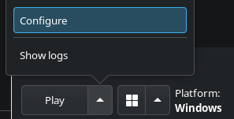

Then in the opened window go to “System options”

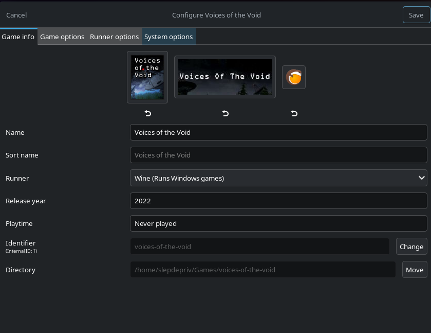

Then hit the little slider to enable it.

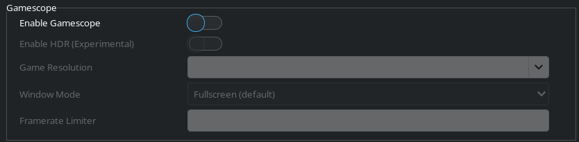

Enter the resolution desired like so.

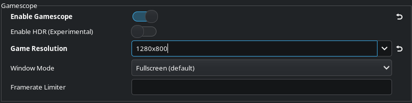

### Using Gamescope with Wine
Instead of directly using wine in a terminal you can launch it through gamescope by doing “gamescope  -W 1280 -H 800  -- wine path/to/Votv.exe”, replace the 1280 and 800 with the Width and Height desired.

# Issues
## TV not working
One of the most common issues when playing Voices of The Void on a Linux system is the TV not working, the exact way this issue appears can vary heavily based on factors like Distro.

The most common appearance of this issue is when you select the video to play from the TV menu, it simply stays black with no signs of life:


Though for some it will show “none”, “error”, or “loading” when selecting a video in the TV Menu.

### Solution 1: Use Proton 10
The best way to get the TV working is by using the Steam/Proton method of running Voices of The Void, as Proton is the more developed compatibility layer for gaming and thus has the most fixes available while using it.

Assuming you’re running Voices of The Void through steam, double check that you’re using Proton 10 by right-clicking Votv in your library, hitting properties, then going to "Compatibility" in the menu it opens up, if everything is correct you should see:

<!-- re-using this image cause its literally the same thing lol -->


If it’s not set to Proton 10, please set it to Proton 10. With any luck this alone will be enough to make TVs work, however it’s highly likely you’ll need to combine it with Solution 2.
### Solution 1.5: Use Proton GE
Instead of using Proton 10 made by Valve themselves, there’s also a custom community version of Proton out there known as “Proton-GE” which often includes even more fixes and compatibility when it comes to running games. Which may or may not be better for running Voices of The Void compared to Proton 10.

To install Proton GE you can visit the official github: https://github.com/GloriousEggroll/proton-ge-custom or use an installer like ProtonPlus https://protonplus.vysp3r.com/ or ProtonUp-Qt https://davidotek.github.io/protonup-qt/ to quickly install it without much fuss, both should be available on Flathub.

After installing it and restarting steam, it should appear alongside the rest of the Proton options in the Compatibility section to be selected:

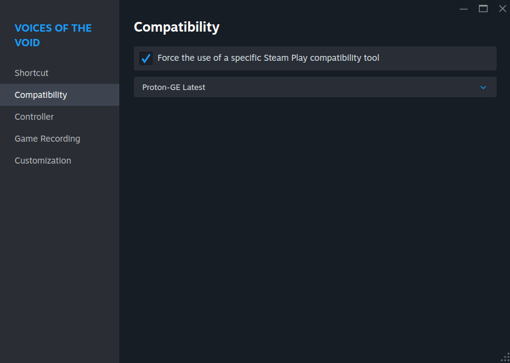


### Solution 2: Custom Launch Option
Often times just using Proton 10 (or GE) isn’t enough, so another common fix paired with it is adding:
```
WINE_DO_NOT_CREATE_DXGI_DEVICE_MANAGER=1 %command%
```

To the launch options of your game. To do so right-click Votv in your library, hit properties, then in the Shortcut area paste in the Launch Option above into the “Launch Options” text box, once done it should look like this:

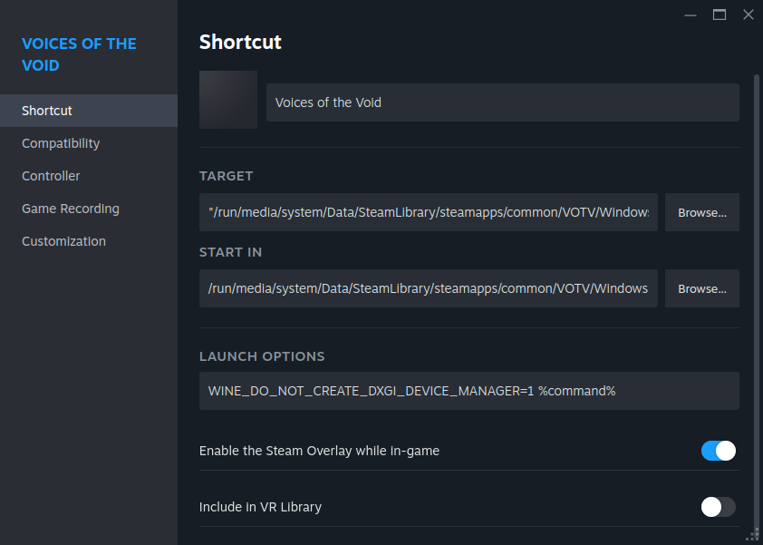

This for most people should be enough to fix the TV, however in the rare cases where it is not you can try Solution 3.
### Solution 3: Lav Filters
This is the least tested of the solutions and its validity is questionable, it’s still listed here just in-case. The fix in question involves using a program called ProtonTricks to install a windows component called LavFilters for Votv to use.

First install ProtonTricks from Flathub https://flathub.org/en/apps/com.github.Matoking.protontricks or it’s official github https://github.com/Matoking/protontricks

Once installed, launch it from the start menu/app launcher. Once open you should see a menu something like this:

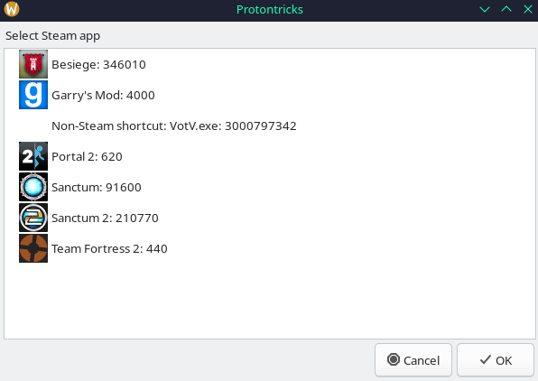

It should show every game on steam you’re using Proton for, including the the Non-Steam shortcut added for Voices of The Void. Select it and press OK:

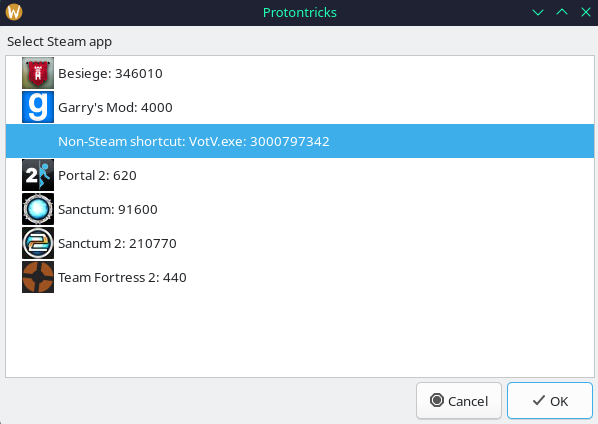

Another menu should popup, in this one just make sure “Select the default wineprefix” is selected, then hit OK.

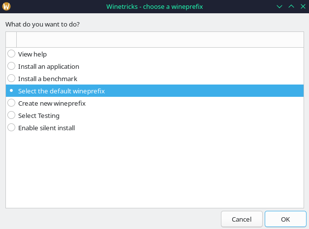

Again, another menu. Select the top option “Install a Windows DLL or component” and hit OK again.

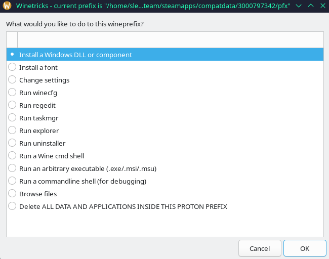

This will open a giant list of various Windows components to download, scroll down until you find “lavfilters” and click on it, then ofcourse hit OK.

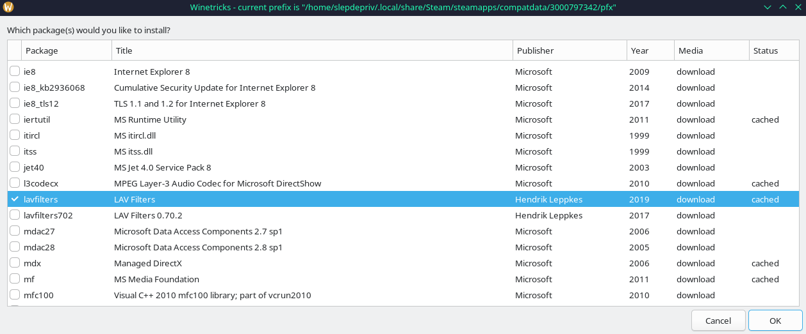

This will open an installer, don’t worry about the file path just hit Next.

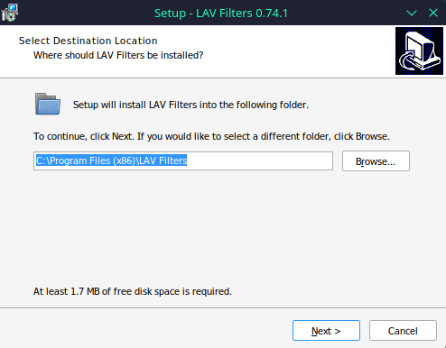

Make sure all options are selected, then hit Next again.

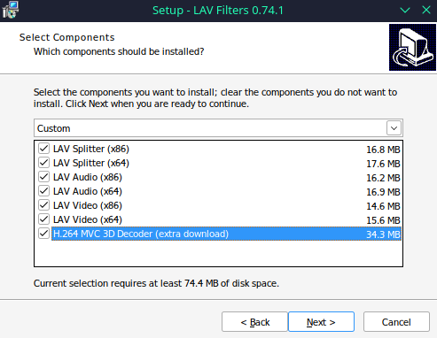

Next again.

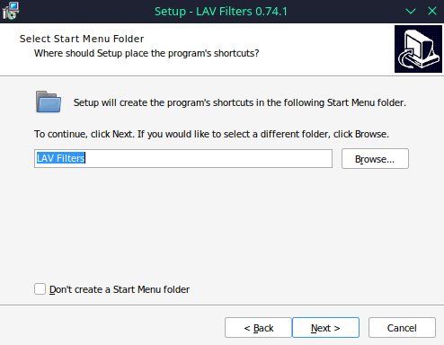

Again.

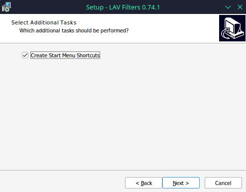

Select every checkbox in this menu then hit Next again.

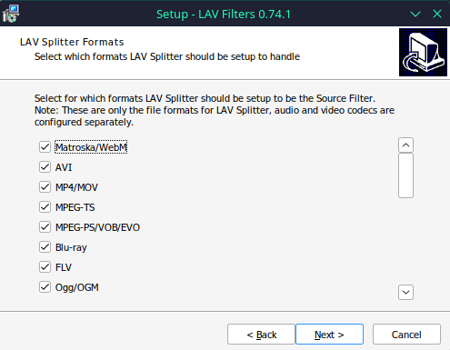

And finally, hit Install.

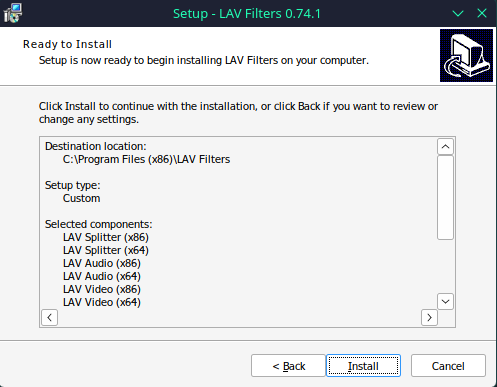

After waiting a bit for it to install, hit Finish.

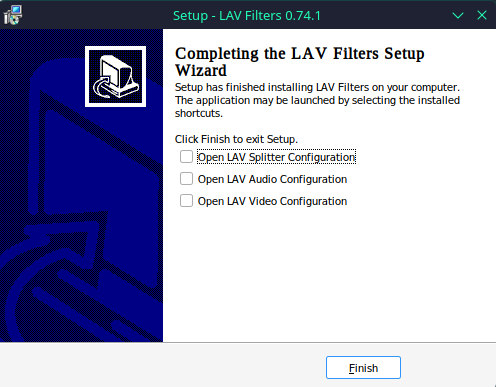

You can now close ProtonTricks and open Voices of The Void to check if the issue has been fixed, if not you may be out of luck/

## Streamed videos on the tv not working:

### Description:
This is an issue that is yet to have been resolved officially

### Fix:
A work around has been found via the use of a script to dynamically copy sections of the streamed media, convert them into a normal mp4 file with a specific duration  targeted via file:// and works by setting it to “sequence”.

## 3D printable objects not showing up while other custom assets do:

### Description:
This issue happens when trying to load 3D printable objects, the 3D prints won’t show up while other custom assets such as TV videos, Radio audio, custom poster, etc.. will.

### Fix:
User the “Open Assets Folder” button.

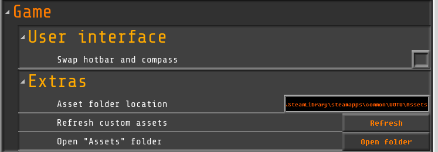

This window should open:

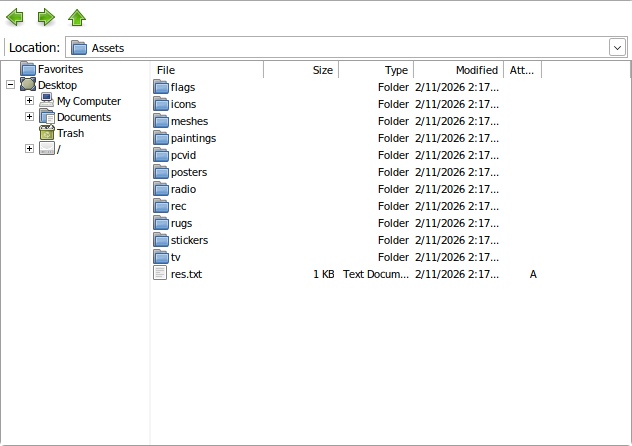

Click and copy the path:

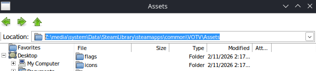

Paste the path the in “Asset folder location”  setting and press refresh:

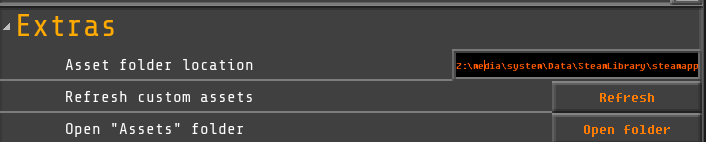

Your 3D prints should now show up

## Black screen when loading into save:

### Description:
When loading into any save your screen will go black, you can still press buttons and hear yourself move around but you’ll see nothing. Pausing will allow you to see but only while you’re paused

### Fix:
Turn off “Automatic screen res” in the Graphics>Display section of settings and restart the game

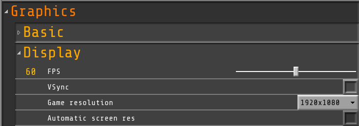


